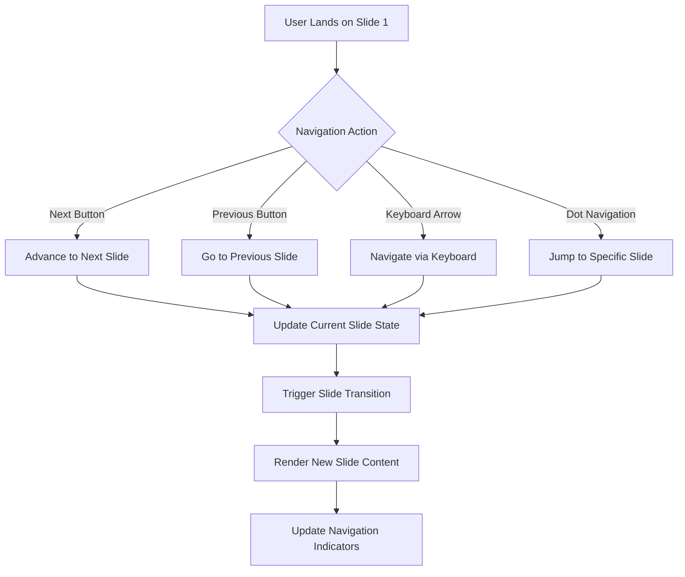
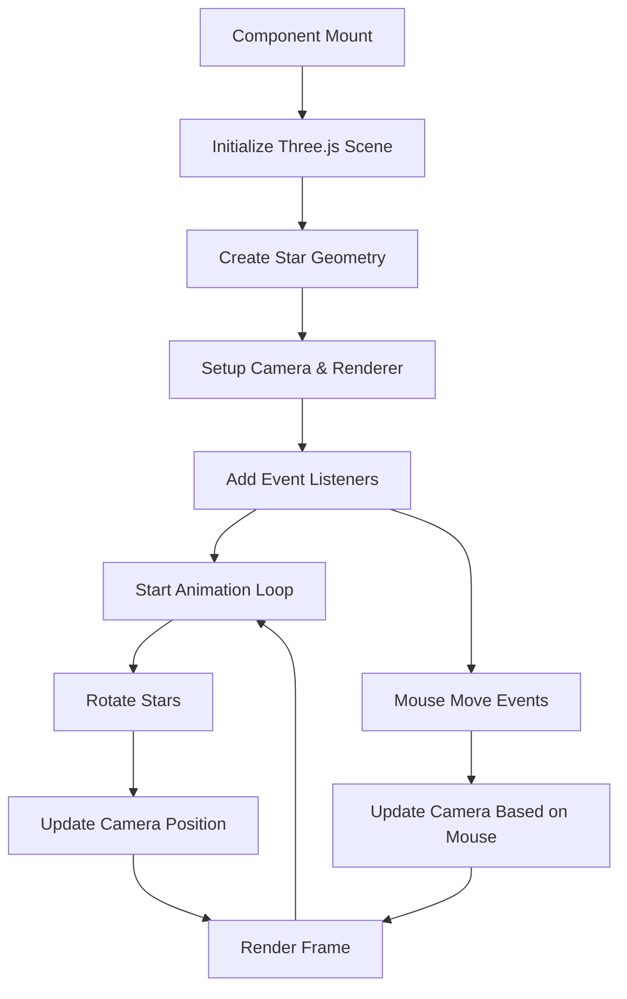
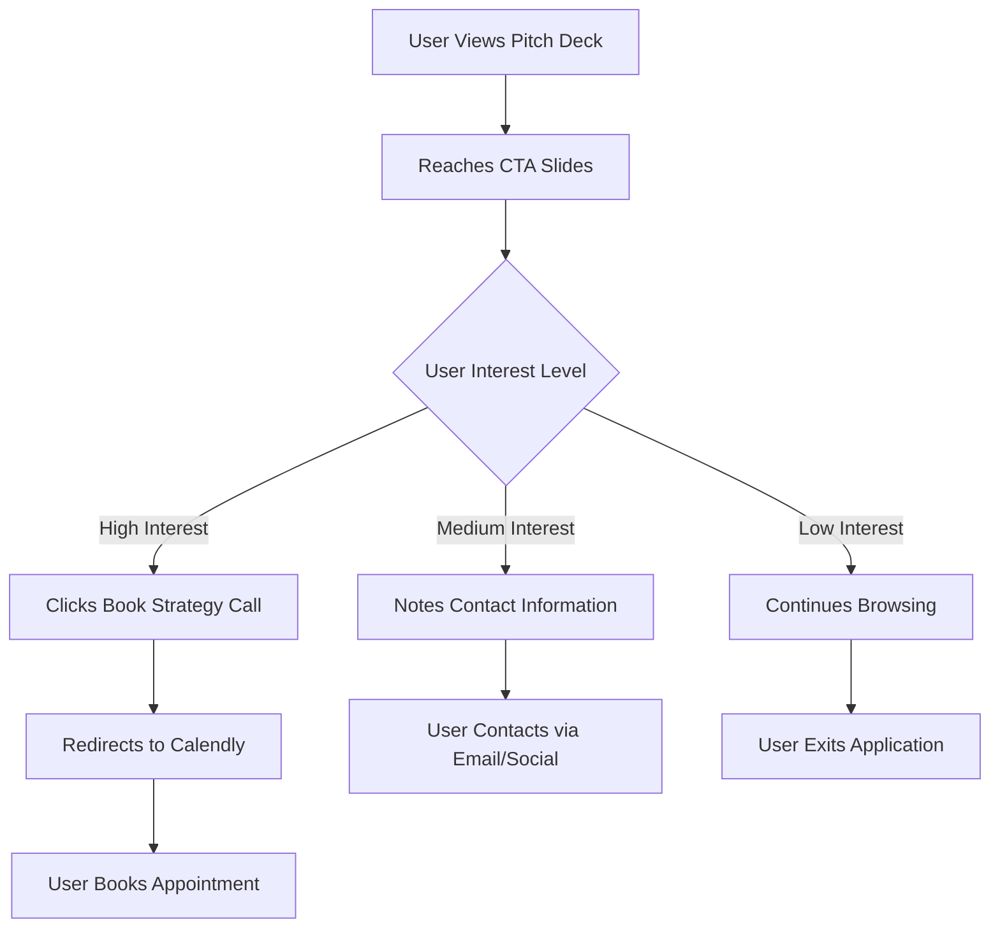
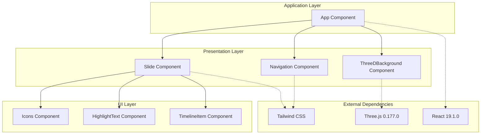
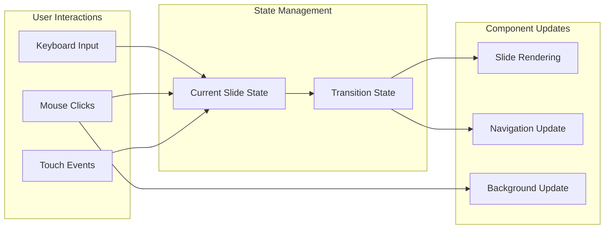
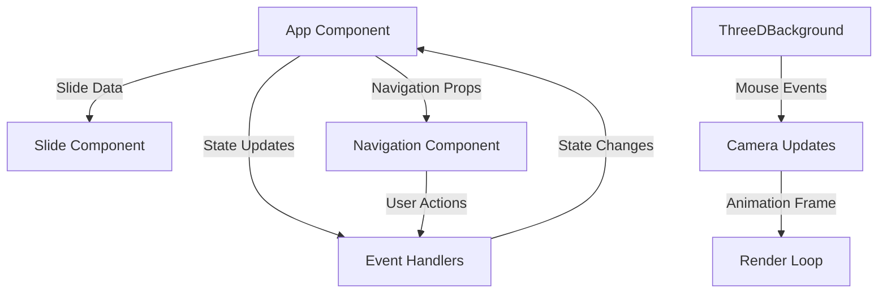
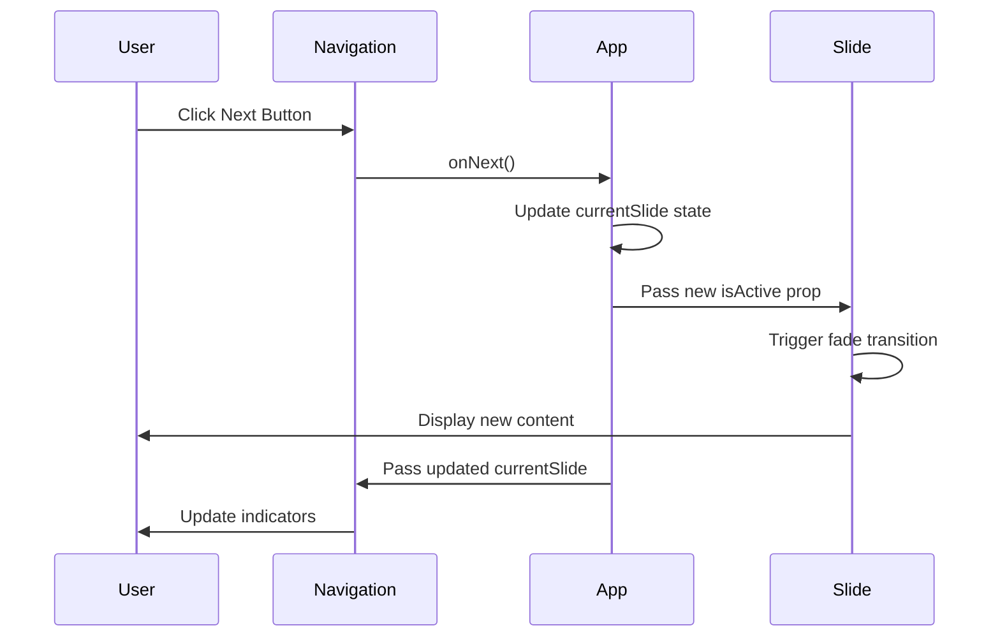
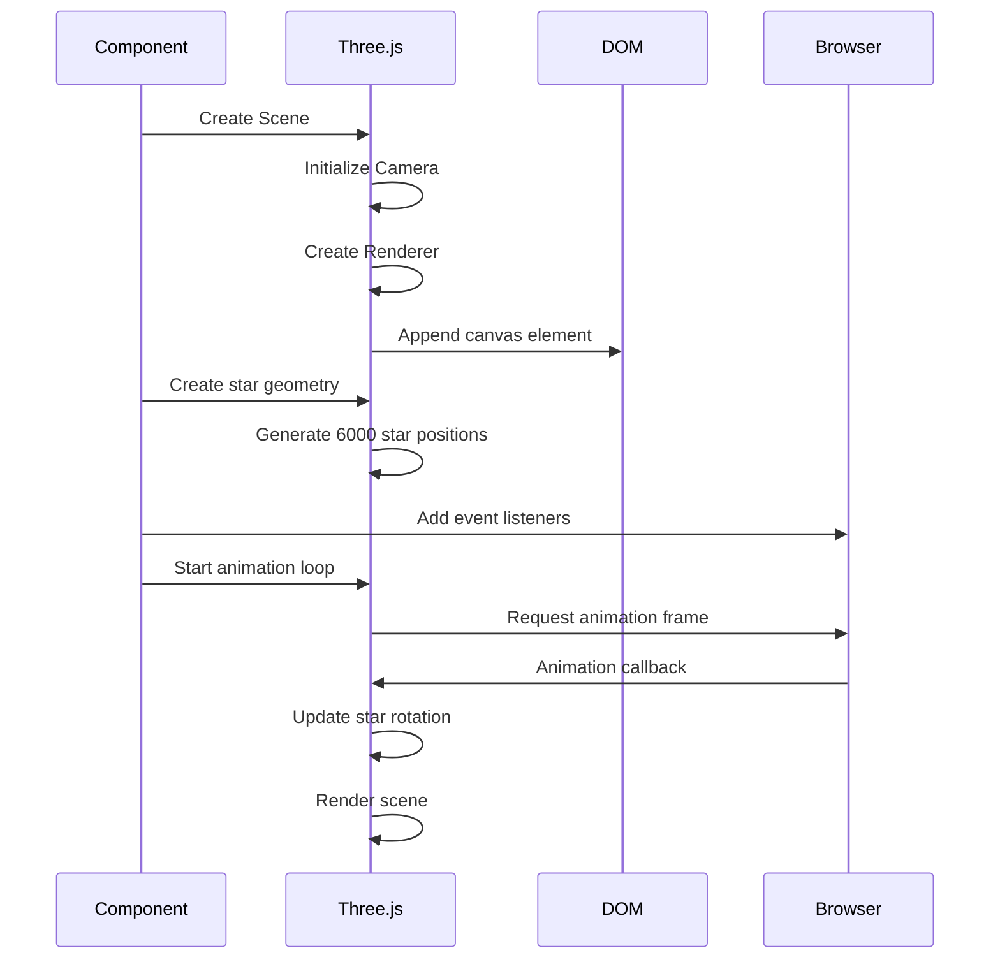
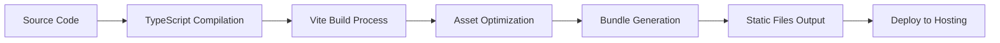

# Sloe Media AI Growth Engine Pitch Deck - Architectural Document

## Table of Contents
- [High-Level Application Overview](#high-level-application-overview)
- [Main Components](#main-components)
- [Key Data Models](#key-data-models)
- [Core Workflows](#core-workflows)
- [Technology Stack](#technology-stack)
- [Component Architecture](#component-architecture)
- [Data Flow Diagrams](#data-flow-diagrams)
- [Sequence Diagrams](#sequence-diagrams)
- [Deployment Strategy](#deployment-strategy)
- [Performance Considerations](#performance-considerations)
- [Security Considerations](#security-considerations)
- [Future Enhancements](#future-enhancements)

## High-Level Application Overview

### Purpose
The Sloe Media AI Growth Engine Pitch Deck is an interactive web-based presentation application designed to showcase Sloe Media's AI-powered advertising and growth services. The application serves as a digital marketing tool to engage potential clients through an immersive, visually appealing slideshow experience.

### Core Objectives
- **Client Engagement**: Provide an interactive and visually stunning presentation experience
- **Service Showcase**: Demonstrate Sloe Media's capabilities through structured content presentation
- **Lead Generation**: Include clear call-to-action elements for booking strategy calls
- **Brand Representation**: Reflect the company's technical expertise through sophisticated UI/UX

### Target Audience
- Product-based brands (eCommerce, Fashion, Beauty, DTC)
- Service-based clients (Coaches, Personal Brands, Info Products)
- Business owners seeking AI-powered growth solutions

## Main Components

### Frontend Components
The application is built entirely as a frontend Single Page Application (SPA) with the following main components:

#### 1. **Presentation Layer**
- Interactive slide deck with 15 comprehensive slides
- Navigation controls with keyboard and mouse support
- 3D animated background for enhanced visual appeal
- Responsive design for multiple device types

#### 2. **User Interface Components**
- **App Component**: Main application container and state management
- **Slide Component**: Individual slide rendering and transition management
- **Navigation Component**: Slide navigation controls and indicators
- **ThreeDBackground Component**: WebGL-based 3D star field animation
- **Icons Component**: Custom SVG icon library

#### 3. **Content Management**
- Static content embedded within React components
- Structured slide data with consistent formatting
- Brand-specific styling and visual elements

### Backend Components
**Note**: This application currently operates as a client-side only application with no backend infrastructure.

### Database
**Note**: No database is currently implemented. All content is statically defined.

### External Integrations
- **Calendly Integration**: For booking strategy calls
- **Email Contact**: Direct email communication channel
- **Social Media**: Instagram handle reference

## Key Data Models

### Slide Data Model
```typescript
interface SlideContent {
  id: number;
  title: string;
  content: React.ReactNode;
  type: 'title' | 'content' | 'testimonial' | 'pricing' | 'contact';
}
```

### Navigation State Model
```typescript
interface NavigationState {
  currentSlide: number;
  totalSlides: number;
  isTransitioning: boolean;
}
```

### Service Package Model
```typescript
interface ServicePackage {
  name: string;
  price: string;
  duration: 'one-time' | 'monthly';
  features: string[];
  isPopular: boolean;
  ctaText: string;
}
```

### Client Segment Model
```typescript
interface ClientSegment {
  type: 'product-based' | 'service-based';
  title: string;
  description: string;
  industries: string[];
  painPoints: string[];
  solutions: string[];
  focusMetrics: string[];
}
```

## Core Workflows

### User Navigation Workflow


### 3D Background Animation Workflow


### Lead Generation Workflow


## Technology Stack

### Frontend Stack
| Technology | Version | Purpose |
|------------|---------|---------|
| **React** | ^19.1.0 | UI framework for component-based architecture |
| **TypeScript** | ~5.7.2 | Type safety and enhanced developer experience |
| **Three.js** | ^0.177.0 | 3D graphics and animation |
| **Tailwind CSS** | Latest (CDN) | Utility-first CSS framework |
| **Vite** | ^6.2.0 | Build tool and development server |

### Development Tools
| Tool | Purpose |
|------|---------|
| **Node.js** | Runtime environment for build tools |
| **npm** | Package management |
| **ESLint** | Code linting and quality assurance |
| **TypeScript Compiler** | Type checking and compilation |

### External Services
| Service | Purpose |
|---------|---------|
| **Calendly** | Appointment scheduling integration |
| **Tailwind CDN** | CSS framework delivery |
| **Google Fonts** | Typography (Inter font family) |
| **ESM.sh** | Module delivery for React/Three.js |

## Component Architecture



### Component Responsibilities

#### App Component
- **State Management**: Manages current slide state and navigation
- **Event Handling**: Keyboard navigation and slide transitions
- **Content Organization**: Defines all slide content and structure
- **Route Coordination**: Orchestrates interactions between components

#### Slide Component
- **Content Rendering**: Displays individual slide content
- **Transition Management**: Handles fade-in/fade-out animations
- **Accessibility**: Manages focus and pointer events
- **Responsive Layout**: Ensures proper display across devices

#### Navigation Component
- **User Controls**: Previous/next buttons and slide indicators
- **State Visualization**: Shows current slide position
- **Accessibility**: Keyboard navigation support
- **Visual Feedback**: Hover states and disabled states

#### ThreeDBackground Component
- **3D Rendering**: WebGL-based star field animation
- **Performance Optimization**: Efficient particle system management
- **Interactivity**: Mouse-responsive camera movement
- **Resource Management**: Proper cleanup on unmount

## Data Flow Diagrams

### Application State Flow


### Component Communication Flow


## Sequence Diagrams

### Slide Navigation Sequence


### 3D Background Initialization Sequence


## Deployment Strategy

### Build Process


### Recommended Hosting Options
1. **Vercel** - Optimal for React/Vite applications
2. **Netlify** - Easy deployment with CDN
3. **GitHub Pages** - Free hosting for static sites
4. **AWS S3 + CloudFront** - Scalable enterprise solution

### Environment Configuration
- **Development**: Local Vite server with hot reload
- **Production**: Optimized static build with asset compression
- **CDN Integration**: Tailwind CSS and external dependencies

## Performance Considerations

### Optimization Strategies
1. **Component Lazy Loading**: Consider splitting slides into separate chunks
2. **Three.js Optimization**: Efficient particle system with limited draw calls
3. **Asset Optimization**: Compressed images and optimized fonts
4. **Bundle Splitting**: Separate vendor and application code

### Performance Metrics
- **First Contentful Paint**: Target < 1.5s
- **Largest Contentful Paint**: Target < 2.5s
- **Cumulative Layout Shift**: Target < 0.1
- **Frame Rate**: Maintain 60fps for 3D animations

### Memory Management
- Proper cleanup of Three.js resources on component unmount
- Event listener removal to prevent memory leaks
- Efficient React component re-rendering through proper dependency arrays

## Security Considerations

### Current Security Measures
1. **No Backend**: Eliminates server-side attack vectors
2. **Static Content**: No dynamic data injection vulnerabilities
3. **HTTPS**: Secure content delivery
4. **CSP Headers**: Content Security Policy implementation recommended

### External Service Security
- **Calendly Integration**: Trusted third-party service
- **CDN Dependencies**: ESM.sh and Tailwind CDN security

### Future Security Recommendations
1. Implement Content Security Policy headers
2. Add integrity checks for external dependencies
3. Consider hosting dependencies locally for production

## Future Enhancements

### Potential Features
1. **Analytics Integration**: Track user engagement and slide completion rates
2. **A/B Testing**: Test different content variations
3. **Multi-language Support**: Internationalization capabilities
4. **Custom Branding**: White-label version for partners
5. **Interactive Elements**: Forms, polls, or quizzes within slides

### Technical Improvements
1. **Progressive Web App**: Offline capability and app-like experience
2. **Advanced Animations**: More sophisticated slide transitions
3. **Accessibility Enhancements**: Screen reader optimization
4. **Performance Monitoring**: Real-time performance tracking

### Content Management
1. **CMS Integration**: Dynamic content management
2. **Template System**: Reusable slide templates
3. **Media Management**: Dynamic image and video handling
4. **Version Control**: Content versioning and rollback capabilities

---

**Document Version**: 1.0  
**Last Updated**: June 28, 2025  
**Author**: Senior Software Architect  
**Next Review**: Q3 2025
